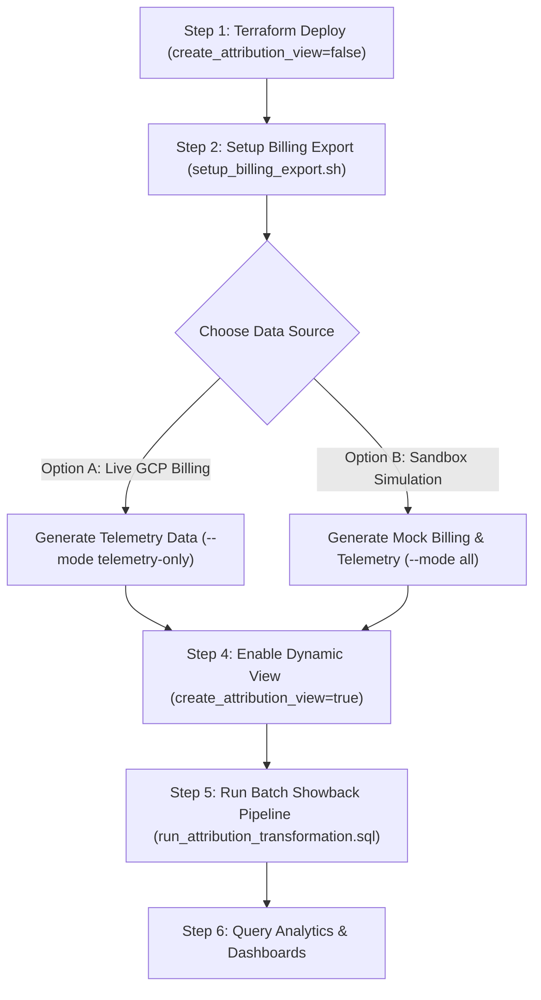

# GCP Billing Export & GCS I/O Cost Showback Engine

An end-to-end demonstration joining **Google Cloud BigQuery Detailed Billing Exports** with **Client-Side GCS I/O Observability Telemetry** collected from multi-tenant compute workloads (Spark, Presto, Ray, Hive) running on Google Cloud.

This architecture bridges the visibility gap between bucket-level GCS billing SKUs (Storage, Class A/B Operations, Inter-Region Egress) and granular job/workload execution dimensions (`application_id`, `engine`, `ugi`, `team`, `dataset_path`).

---

## 🏗️ Architecture & Google Cloud Billing Export Pattern

### 1. Google Cloud Billing Export (Google-Managed)
Following Google Cloud best practices, the Cloud Billing service automatically creates and maintains the Detailed Usage Cost export table (`gcp_billing_export_resource_v1_<BILLING_ACCOUNT_ID>`) in BigQuery.
* **Dataset**: Provisioned via Terraform (`google_bigquery_dataset.billing_export`).
* **Table & Schema**: Managed automatically by Google Cloud Billing upon enabling export in the Cloud Billing Console. Schema evolution (e.g. new SKU metadata, `cost_at_list`, `tags`) is handled by Google without manual schema drift.

### 2. Custom Observability & Showback (User-Managed)
* **Observability Dataset & Table** (`billing_observability_dataset.client_io_aggregated_events`): Hourly reduced GCS I/O telemetry emitted by filesystem stream clients.
* **Showback Dataset & Attribution View/Table** (`billing_showback_dataset.showback_cost_attribution` & `vw_showback_cost_attribution`): Joins bucket SKU hourly totals with client-side byte/operation ratios to allocate exact SKU dollars per workload and dataset path.

---

## 📁 Repository Structure

```text
bq-cloudlake-attribution/
├── terraform/                      # Infrastructure as Code (Terraform)
│   ├── main.tf                     # Root Terraform entry point & provider config
│   ├── variables.tf                # Input variables (project_id, billing_account_id, datasets)
│   ├── outputs.tf                  # BigQuery dataset & table outputs
│   ├── terraform.tfvars.example    # Example tfvars input file
│   └── modules/
│       └── bq_showback/            # Module provisioning BigQuery datasets, tables & views
│           ├── main.tf
│           ├── variables.tf
│           └── outputs.tf
├── notebooks/                      # Interactive Data Preparation & Analytics
│   └── gcs_cost_showback_dataprep.ipynb # BigFrames & BigQuery SQL Notebook
├── scripts/                        # Automation & Synthetic Generator
│   ├── setup_billing_export.sh     # CLI automation to verify/setup GCP Billing Export & BigQuery dataset
│   ├── generate_synthetic_data.py  # Dual-mode synthetic data generator (auto-splits SQL under 1MB)
│   ├── load_synthetic_data.sh      # Helper CLI to load split synthetic SQL parts into BigQuery
│   └── run_attribution_transformation.sql # BigQuery SQL attribution transformation pipeline
└── README.md                       # Documentation & Deployment Guide
```

---

## 📊 Datasets & Tables

| Dataset ID | Table / View ID | Type | Managed By | Description |
| :--- | :--- | :--- | :--- | :--- |
| `billing_export_sim` | `gcp_billing_export_resource_v1_<ACCOUNT_ID>` | Table | Google Cloud Billing / Mock | Standard Detailed Billing Export containing resource-level GCS SKUs. |
| `billing_observability_dataset` | `client_io_aggregated_events` | Table | Terraform & Telemetry Stream | Hourly reduced GCS I/O telemetry (Spark, Presto, Ray, Hive). |
| `billing_showback_dataset` | `showback_cost_attribution` | Table | Terraform & Pipeline | Persisted showback table allocating costs per `application_id`, user, and dataset path. |
| `billing_showback_dataset` | `vw_showback_cost_attribution` | View | Terraform | Dynamic view computing showback attribution on-the-fly. |

---

## 🚀 Deployment & Usage Workflow



---

### Step 1: Deploy Infrastructure with Terraform (`create_attribution_view = false`)

> [!IMPORTANT]
> BigQuery validates SQL queries **at view creation time**. Because the dynamic view `vw_showback_cost_attribution` references the billing export table (which is created by Google Cloud Billing *after* the dataset is provisioned), **keep `create_attribution_view = false` on your initial deploy**.

1. Copy and configure `terraform.tfvars`:
   ```bash
   cp terraform/terraform.tfvars.example terraform/terraform.tfvars
   ```
2. Edit `terraform/terraform.tfvars`:
   ```hcl
   gcp_project_id                    = "YOUR_GCP_PROJECT_ID"
   gcp_region                        = "US" # or us-central1
   billing_account_id                = "01A2B3-C4D5E6-F78901"
   billing_dataset_id                = "billing_export_sim"
   observability_dataset_id          = "billing_observability_dataset"
   showback_dataset_id               = "billing_showback_dataset"
   enable_billing_export_dataset_iam = true
   create_attribution_view           = false # Keep false during initial deployment

   # Optional: Interactive Notebook & Execution Subnetwork
   upload_notebook                   = true  # Upload interactive showback notebook to GCS
   create_notebook_subnet            = true  # Provision dedicated subnetwork for Colab Enterprise runtimes
   network_name                      = "default" # Or your custom VPC name (e.g. "my-vpc")
   notebook_subnet_name              = "lakehouse-notebook-subnet"
   notebook_subnet_cidr              = "10.3.0.0/24"
   ```
3. Initialize and apply Terraform:
   ```bash
   cd terraform
   terraform init
   terraform apply
   cd ..
   ```
   **What this provisions:**
   - ✅ BigQuery Datasets: `billing_export_sim`, `billing_observability_dataset`, `billing_showback_dataset`.
   - ✅ Dataset IAM: Grants `roles/bigquery.dataEditor` to `billing-export-bigquery@system.gserviceaccount.com`.
   - ✅ Telemetry Table: `billing_observability_dataset.client_io_aggregated_events`.
   - ✅ Persisted Showback Table: `billing_showback_dataset.showback_cost_attribution`.
   - ✅ Notebook Storage Bucket: `<project_id>-lakehouse-notebooks` with uploaded notebook (project variables injected automatically).
   - ✅ Dedicated Subnetwork: `lakehouse-notebook-subnet` in your target region with Private Google Access enabled for Colab Enterprise runtime compute.

---

### Step 2: Configure & Verify Billing Export

Run the helper CLI script to verify prerequisites, test dataset permissions, and get the direct 1-click Google Cloud Console link:

```bash
./scripts/setup_billing_export.sh
```

*(Optional) Open the GCP Console directly in your browser:*
```bash
./scripts/setup_billing_export.sh --open-console
```

#### 3-Step Console Handshake:
1. Open the direct URL output by the script or Terraform:
   `https://console.cloud.google.com/billing/<BILLING_ACCOUNT_ID>/export/bigquery?project=<PROJECT_ID>`
2. Under **Detailed usage cost**, click **Edit Settings** (or **Enable Export**).
3. Select your **Project** and BigQuery dataset (`billing_export_sim`), and click **Save**.

---

### Step 3: Ingest Telemetry & Billing Data

Choose **Option A** (live GCP environment) or **Option B** (instant sandbox test):

#### Option A: Production Setup with Real GCP Billing Export
Once Google Cloud Billing begins delivering records into BigQuery:
1. Generate **telemetry data only** for multi-tenant workloads:
   ```bash
   python3 scripts/generate_synthetic_data.py \
     --mode telemetry-only \
     --project-id YOUR_GCP_PROJECT_ID
   ```
2. Ingest telemetry data into BigQuery:
   ```bash
   ./scripts/load_synthetic_data.sh
   ```

#### Option B: Standalone Demo / Sandbox Simulation (Immediate Testing)
To test immediately without waiting for live GCP billing export data to arrive:
1. Generate **both** mock standard billing export records and client telemetry (automatically split into files under BigQuery's 1024 KB limit):
   ```bash
   python3 scripts/generate_synthetic_data.py \
     --mode all \
     --project-id YOUR_GCP_PROJECT_ID \
     --billing-account-id YOUR_BILLING_ACCOUNT_ID
   ```
   *(Optional: pass `--execute-bq` to generate and run in one step).*
2. Execute the generated SQL in BigQuery to create the partitioned billing export table and load all records:
   ```bash
   ./scripts/load_synthetic_data.sh
   ```

---

### Step 4: Enable the Dynamic Attribution View (`create_attribution_view = true`)

Now that the billing export table (`gcp_billing_export_resource_v1_<BILLING_ACCOUNT_ID>`) exists in BigQuery (from Step 2 or Step 3), enable the dynamic view:

1. Update `create_attribution_view = true` in `terraform/terraform.tfvars` (or pass `-var="create_attribution_view=true"`):
   ```bash
   cd terraform
   terraform apply -var="create_attribution_view=true"
   cd ..
   ```
2. This creates `billing_showback_dataset.vw_showback_cost_attribution` for real-time, on-the-fly showback SQL calculations.

---

### Step 5: Run Cost Showback Transformation Pipeline (Batch Table)

To populate the partitioned, clustered table `billing_showback_dataset.showback_cost_attribution` for high-performance reporting dashboards, you can choose between two methods:

#### Method A: Run Batch SQL Script via CLI
```bash
bq query --use_legacy_sql=false < scripts/run_attribution_transformation.sql
```

#### Method B: Run Interactive Jupyter Notebook (`BigFrames` & `%%bqsql`)

You can run the interactive notebook either locally or in Google Cloud:

* **Locally in VS Code / JupyterLab**:
  Open [`notebooks/gcs_cost_showback_dataprep.ipynb`](notebooks/gcs_cost_showback_dataprep.ipynb).

* **In Google Cloud (Colab Enterprise or BigQuery Studio)**:
  1. Open [Colab Enterprise Console](https://console.cloud.google.com/agent-platform/colab/notebooks) or [BigQuery Studio](https://console.cloud.google.com/bigquery).
  2. Open the notebook from Cloud Storage using the GCS URI output by Terraform:
     ```text
     gs://<PROJECT_ID>-lakehouse-notebooks/notebooks/gcs_cost_showback_dataprep.ipynb
     ```
  3. When connecting or configuring the runtime compute, select:
     * **Network**: Your VPC network (e.g., `pablito-vpc` or `default`)
     * **Subnetwork**: `lakehouse-notebook-subnet` *(provisioned by Terraform in your region with Private Google Access)*

* **What the notebook provides**:
  * Step-by-step data inspection of raw telemetry & billing records.
  * Interactive attribution formula modeling using BigFrames and `%%bqsql`.
  * Visual analytics (Top 5 costly applications, department breakdowns, dataset path heatmaps).
  * Direct table materialization into `billing_showback_dataset.showback_cost_attribution`.
  * Reconciliation audit queries comparing allocated dollars to billed SKU dollars.

---

### Step 6: Verify Table & Export Status

You can re-run the CLI script at any time to verify that the billing export table and GCS SKU records are healthy:

```bash
./scripts/setup_billing_export.sh --check-only
```

---

## 💡 Example Analytical Queries

### Query 1: Top 5 Expensive Applications by GCS Cost
```sql
SELECT
  application_id,
  engine,
  team,
  SUM(allocated_cost_usd) AS total_allocated_cost_usd,
  ROUND(SUM(app_bytes) / 1e9, 2) AS total_gb_transferred
FROM
  `billing_showback_dataset.showback_cost_attribution`
GROUP BY
  1, 2, 3
ORDER BY
  total_allocated_cost_usd DESC
LIMIT 5;
```

### Query 2: Cost Breakdown by Dataset Path & Team
```sql
SELECT
  team,
  dataset_path,
  sku_description,
  SUM(allocated_cost_usd) AS cost_usd
FROM
  `billing_showback_dataset.showback_cost_attribution`
GROUP BY
  1, 2, 3
ORDER BY
  cost_usd DESC;
```
